# ROS2 για  Αρχάριους 2
Αρχικα θα δούμε πως δημιουργούμε κοσμο στο Gazebo , Να φτιαξουμε ενα δικο μας robot car και να το δουμε στο RVIZ και στο Gazebo

## Gazebo Create World
### Install Gazebo 
1. Ανοιγουμε το τερματικο και γραφουμε 
     ```shell
     sudo apt install ros-humble-gazebo-*
     ```
  κλεινω και ξανα ανοιγω το τερματικο 

### Gazibo world

2. Για να το καλεσω γραφω gazebo
στο Insert 
εχει Add Path
στο http://models.gazebosim.org/
εχει αντικειμενα ετοιμα απο το gazebo

3. Για να δημιουργησω τοίχους
=> edit => Building Editor 
σχεδιαζουμε τους τοιχους και για να το κανουμε save 
=>file =>Save As(Ctrl+Shift+S) => βαζουμε το ονομα και που θελουμε να το αποθηκευσουμε 
και Save =>Exit (το επομενο παραθυρο )

4. Για απθηκευση World 
File => Save World As => βαζω το οναμα(name.world) και την τοποθεσια  και => Save


Για ανοιξω το κοσμο που δημιουργησα πρεπει να ειμαι στον φακελο που τον αποθηκευσα 
(hercules@hercules:~/gazebo_examples$)

και να γραψω στο terminal 
 ```shell
   gazebo (name.world)
```
 <div style="text-align:center;">
    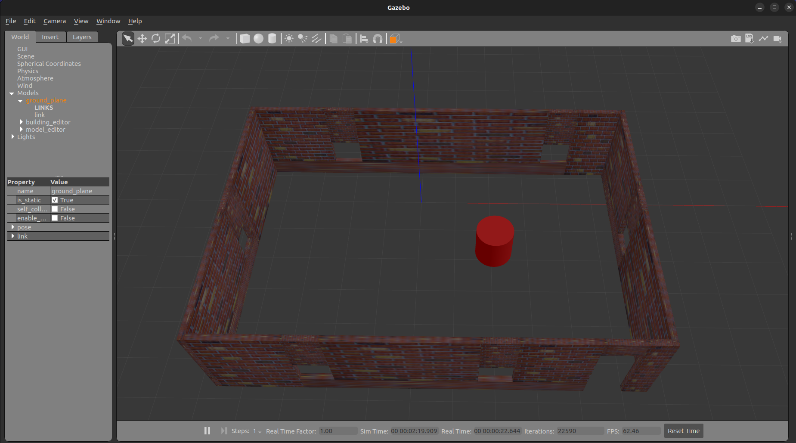
</div>

## Create My Robot URDF
### Setup the URDF File
1. Δημιουργω εναν φακελο με ονομα my_robot

μεσα στον φακελο γραφω :

 ```shell
   touch my_robot.urdf
   code my_robot.urdf
```

2. ανοιγει στο visual code  και γραφω τον κωδικα (υπαχρει στο αρχειο my_robot.urdf στον φακελο my_robot)

Στο τερματικο κανω

```shell
 ros2 launch urdf_tutorial display.launch.py model:=/home/hercules/my_robot/my_robot.urdf 
```


******Παρατηρησεις 

Για την ενωση της ρωδας χρησιμοποιουμαι τον τυπο type="continuous" 

Ενω για μελη που δεν θελουμε να εχουν ευκινισια και απλως να ομαδοποιηθουν βαζουμε τον τυπο type="fixed"

 <div style="text-align:center;">
    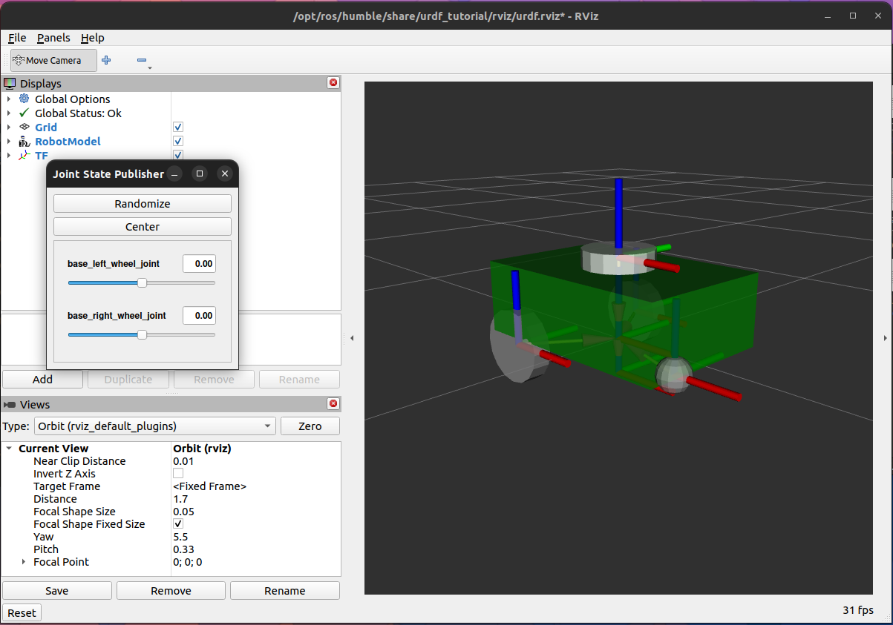
</div>

##  URDF+Xacro creation ,Visualize in RVIZ2 and Gazebo +Teleoperation

1. φταχνω εναν φακελο learn_ros2_ws και src  μετα μπαινω στο src και γραφω
```shell
  ros2 pkg create --build-type ament_cmake --node-name my_node my_first_pkg (ονομα αρχειου το my_first_pkg)
```

****Αν εχω ERRORS****
```shell
  nano /home/hercules/learn_ros2_ws/src/my_first_pkg/package.xml
```

και συμπληρωνω 
Βρείτε την ετικέτα:
```shell
<license>TODO: License declaration</license>
```
Αντικαταστήστε τη με μία από τις προτεινόμενες άδειες χρήσης που υποστηρίζονται από το ament:

Για παράδειγμα, αν χρησιμοποιείτε Apache 2.0:
```shell
<license>Apache-2.0</license>
cd ..
```

Για πληρότητα, δημιουργήστε ένα αρχείο LICENSE στο φάκελο του πακέτου σας:

```shell
touch /home/hercules/learn_ros2_ws/src/my_first_pkg/LICENSE
```

Βήμα 4: Επανεκτέλεση της κατασκευής

Αποθηκεύστε τις αλλαγές και επαναλάβετε την κατασκευή:

```shell
colcon build 
```

και για να τρεξω το αρχειο  urdf πρεπει να ειμαι εξω απο τον φακελο και τρεχω την εντολη :
```shell
ros2 launch urdf_tutorial display.launch.py model:=/home/hercules/learn_ros2_ws/src/my_first_pkg/urdf/my_robot1.urdf 
```
μετα φτιαχνω τρεισ φακελους ```include```  , ```launch``` , ```rviz```  μεσα στο ```my_first_pkg```
μετα ξανα τρεχω το αρχειο ```.urdf``` και κανω save στο φακελο ```rviz```
μετα στο launch δημιουργω δυο αρχεια .py  (```display.launch.py``` && ```gazebo.launch.py``` )
και αυτα τα αρχεια θα τερχω απο δω και στο εξης 

παω επισης και στο αρχειο CMakeList.txt  και συμπληρωνω αυτο 
```shell
#install launch files
install(DIRECTORY
 launch
 urdf
 rviz
 DESTINATION share/${PROJECT_NAME}/
)
```

Στην συνεχεια παω στο τερματικο  κανω ```cd``` 
οσπου να ειμαι στον  φακελος ```learn_ros2_ws``` κανω ```ls``` 
και ξανα κανω  : 
```shell
 colcon build
 ```
μετα 
```shell 
colcon build --symlink-install
source install/local_setup.bash
```

και στην συνεχεια κανω τα εξης :
```shell
gedit ~/.bashrc  (Ανοιγει το αρχειο bashrc)
```

και συμπληρωνω αυτο : ```source ~/learn_ros2_ws/install/setup.bash```
και γραφω στο terminal :
```shell
source .bashrc
```
και πρεπει να βγαινει ετσι :
```shell
hercules@hercules:~$ source .bashrc
hercules@hercules:~$ 
```
Τελος για να το τρεξω  

```shell
ros2 launch my_first_pkg display.launch.py
```
 <div style="text-align:center;">
    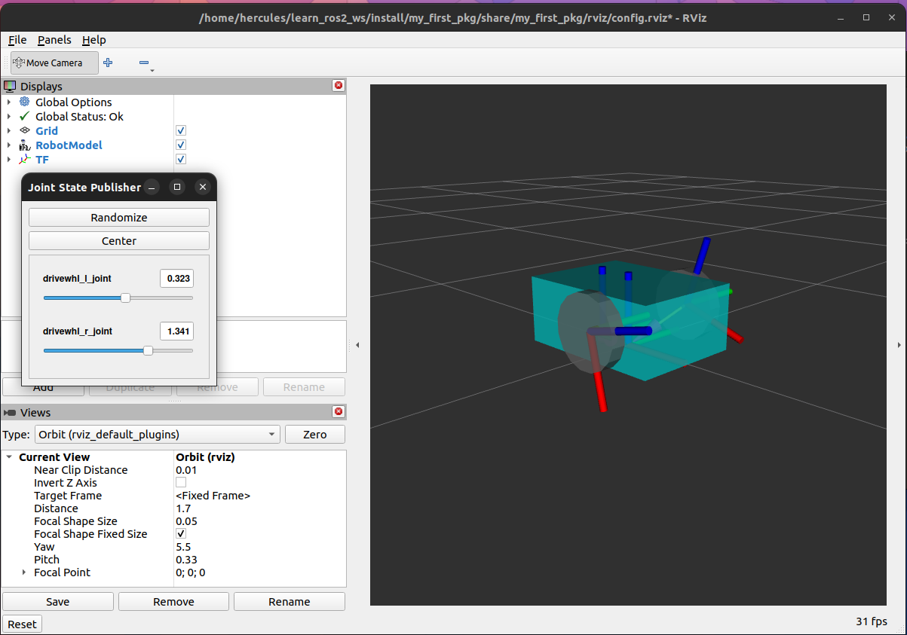
</div>

ή  για να τρεξω στο gazebo γραφω :

```shell
ros2 launch my_first_pkg gazebo.launch.py
```
 <div style="text-align:center;">
    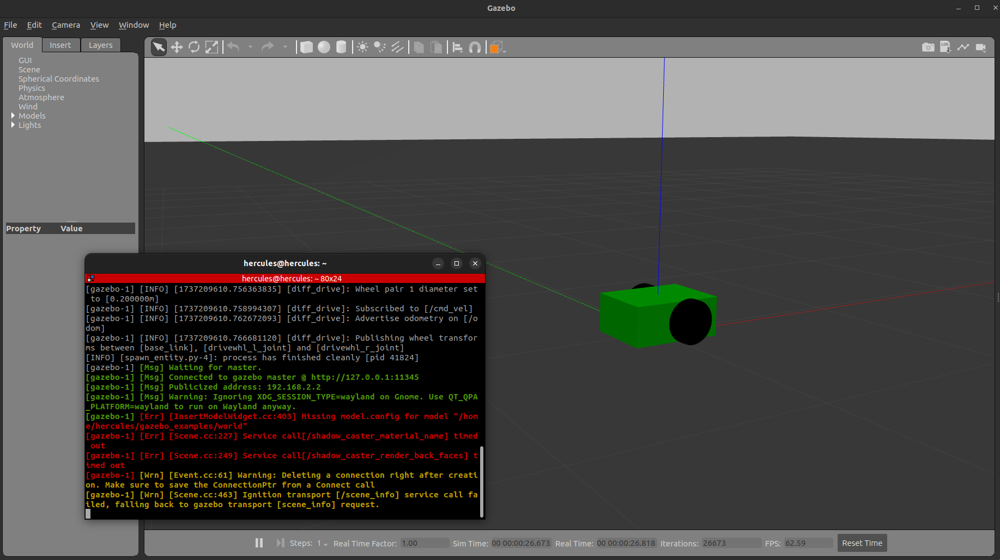
</div>


## Χειρισμός με το πληκτρολόγιο του PC
Σε αλλο τερματικο
```shell
 ros2 topic list 
 ```
 και θα πρεπει να εμφανιζει τα εξης :
```
/clock
/cmd_vel
/joint_states
/odom
/parameter_events
/performance_metrics
/robot_description
/rosout
/tf
/tf_static
```
και μετα 
```shell
ros2 run teleop_twist_keyboard teleop_twist_keyboard 
```

και θα πρεπει να εμφανιζει τα εξης :
```
This node takes keypresses from the keyboard and publishes them
as Twist/TwistStamped messages. It works best with a US keyboard layout.
---------------------------
Moving around:
   u    i    o
   j    k    l
   m    ,    .

For Holonomic mode (strafing), hold down the shift key:
---------------------------
   U    I    O
   J    K    L
   M    <    >

t : up (+z)
b : down (-z)

anything else : stop

q/z : increase/decrease max speeds by 10%
w/x : increase/decrease only linear speed by 10%
e/c : increase/decrease only angular speed by 10%

CTRL-C to quit

currently:	speed 0.5	turn 1.0 
```

### Αν υπαρχει θεμα Επανεκτέλεσης

στο τερματικο γραφω
```shell
ps aux | grep gazebo
```
βλεπω τις διεργασιες 
και σκοτωνω την πρωτη  με την εντολη ```kill -9 <pid>```
ξανα  στο τερματικο γραφω
```shell
ps aux | grep gazebo
```
και πρπει να εχει μια και οχι αλλες 
και ξανα τρεχω τον κωδικα 

### Για χρωματα στο robot
http://wiki.ros.org/simulator_gazebo/Tutorials/ListOfMaterials

### Για γεωμετρια του robot
http://wiki.ros.org/urdf/XML/link

### Για ενωση κομματιων του robot 
http://wiki.ros.org/urdf/XML/joint

## Create Robot Arm in RVIZ (file .Xacro)

 <div style="text-align:center;">
    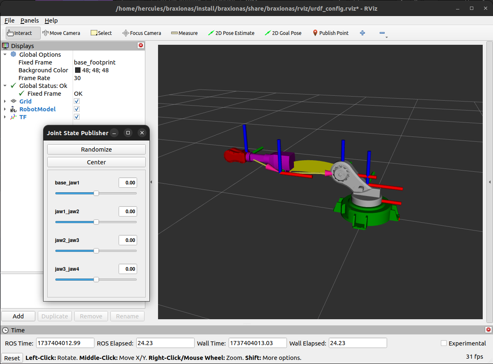
</div>

1. Δημιουργω εναν φακελο braxionas και μεσα σε αυτον εναν φακελο src
```shell
colcon build
```
1.  μεσα στο src εκτελω την εντολη
 ```shell
ros2 pkg create braxionas
```
Διαγραφω τους φακελους include , src και φτιαχνω launch , urdf ,meshes , rviz  
Διαμορφωνω το αρχειο ```CMakeLists.txt``` καταλληλα και μετα 

1. Ανοιγω το αρχειο bashrc
```shell
gedit ~/.bashrc
```
```shell
source ~/braxionas/install/setup.bash
```
και μετα στον φακελο braxionas (log install src build)

```shell
colcon build
colcon build --symlink-install
```

μετα   ```source install/setup.bash```

```shell
ros2 launch braxionas display.launch.xml
```
ή
```shell
ros2 launch braxionas display.launch.py
```

και το αποτελεσμα ειναι :
 <div style="text-align:center;">
    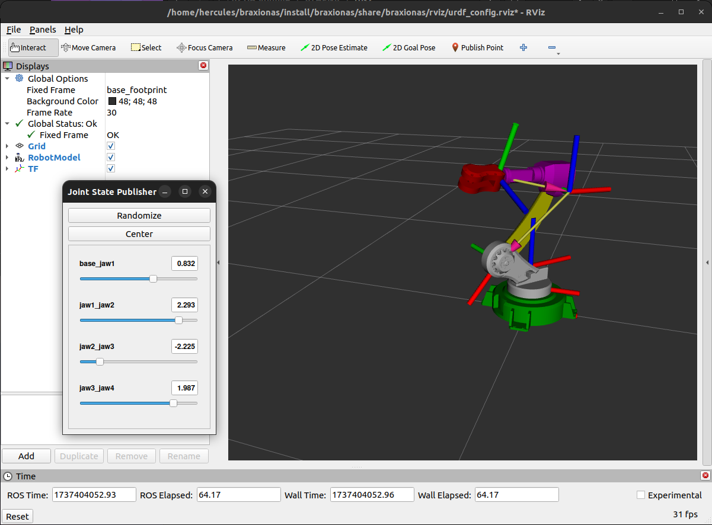
</div>

### NOTES
Τα αχρεια .stl υπαρχουν και στα [Repositories](https://github.com/HerGousis/Robotic_ARM)

## Robot in the  my world (Gazebo) 

1. Δημιουργω εναν φακελο my_robot_description  και μεσα σε αυτον εναν φακελο src
```shell
colcon build
```
  Μετα προσθετουμετουμε τα αρχεια που ειναι ανεβασμενα στο φακελο ```my_robot_description/src ```
Επειτα γραφω στον φακελο  my_robot_description (log install src build)

```shell
colcon build
colcon build --symlink-install
```

μετα   
```shell 
source install/setup.bash
```
και τελος 
```shell
ros2 launch my_robot_bringup my_robot_gazebo.launch.xml 
```

και σε αλλο τερματικο  
```shell
ros2 topic pub /cmd_vel geometry_msgs/msg/Twist "{linear: {x: 0.5},angular:{z: 0}}" 
```
και θα δουμε να κινειται κατα τον αξονα Χ μεσα στο κοσμο που εχουμε δημιουργησει

ή 
```shell
ros2 topic pub /cmd_vel geometry_msgs/msg/Twist "{linear: {x: 0.5},angular:{z: 0.5}}" 
```
θα δουμε οτι κινειται κυκλικα 

 <div style="text-align:center;">
    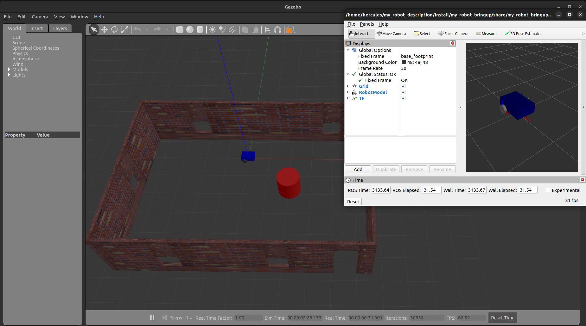
</div>

## Add Camera in Gazebo 

1. Μεσα στο φακελο urdf ```my_robot_description/src/my_robot_description/urdf```
 Προσθετουμε ενα ακομα αρχειο ``` camera.xacro ``` και το συμπληρωνουμε στο αχρειο ``` my_robot.urdf.xacro```
Επειτα γραφω στον φακελο  my_robot_description (log install src build)

```shell
colcon build
colcon build --symlink-install
```

μετα   
```shell 
source install/setup.bash
```
και τελος 
```shell
ros2 launch my_robot_bringup my_robot_gazebo.launch.xml 
```

 <div style="text-align:center;">
    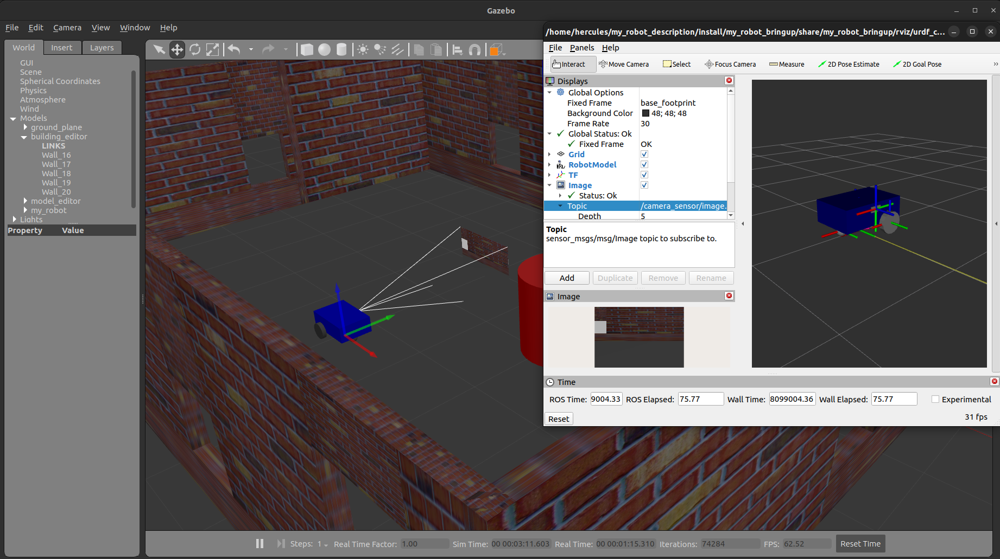
</div>

* Στο rviz για να προσθεσουμε την καμερα πηγενουμε ```Add``` και επιλεγω το ```Image``` και στην συνεχεια στο ```Topic``` επιλεγω την καμερα μου .

## Add lidar

Δημιουγρουμε ενα καινουριγιο αρχειο liadr.xacro και το προσθετουμε στο ```my_robot.urdf.xacro```

```shell
colcon build
colcon build --symlink-install
```

μετα   
```shell 
source install/setup.bash
```
και τελος 
```shell
ros2 launch my_robot_bringup my_robot_gazebo.launch.xml 
```

 <div style="text-align:center;">
    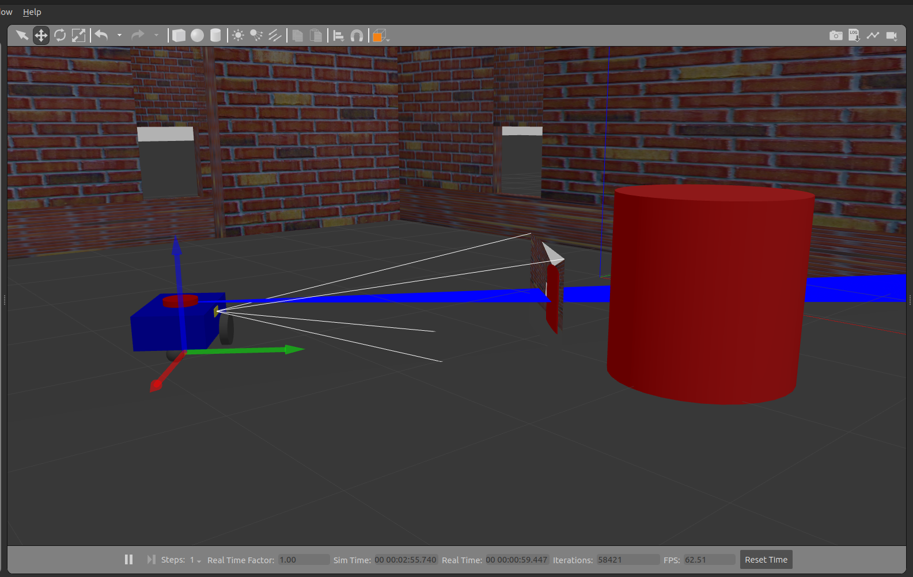
</div>

* για το ROS2 στο lidar.xacro             
 ```shell
 <plugin name="gazebo_ros_ray_sensor" filename="libgazebo_ros_ray_sensor.so">
     <topic_name>/scan</topic_name>
     <frame_name>lidar_link</frame_name>
     <output_type>sensor_msgs/LaserScan</output_type>
 </plugin> 
```

 <div style="text-align:center;">
    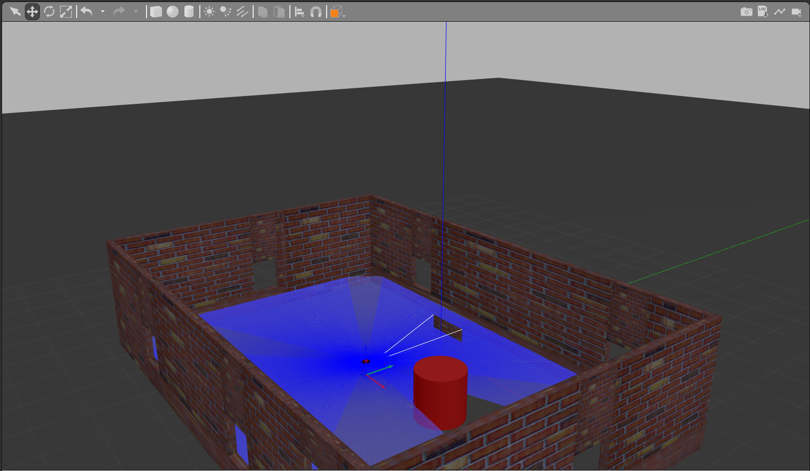
</div>

 <div style="text-align:center;">
    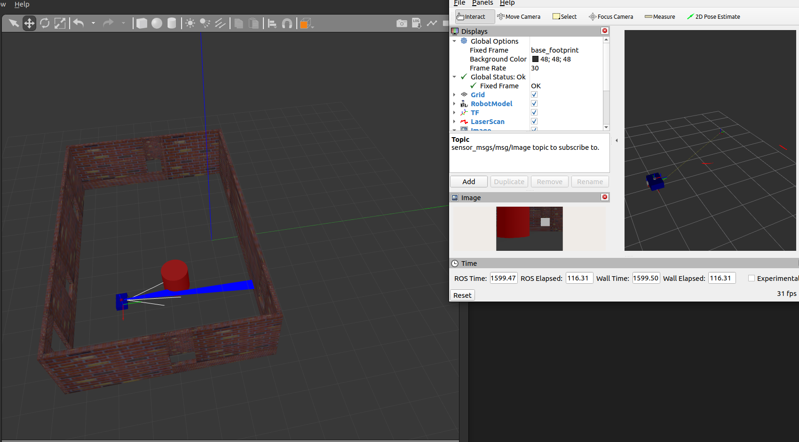
</div>

* Στο rviz για να προσθεσουμε την καμερα πηγενουμε ```Add``` και επιλεγω το ```By topic``` και στην συνεχεια στο ```LaserScan``` επιλεγω την καμερα μου .

## Create Python Script 

## Install OpenCV

στο Τερματικο γραφω :
```shell
pip install opencv-python
```
και μετα 
```shell
sudo apt install ros-humble-cv-bridge
```

 Γραφω στον φακελο ``` my_robot_description/src ```

 ```shell
 ros2 pkg create robot_controller --build-type ament_python --dependencies rclpy
```

και δημιουργειτε ο φακελος ```robot_controller``` 

* στο αρχειο ```package.xml```

συμπληρωνω :

```shell
  <depend>rclpy</depend>
  <depend>geometry_msgs</depend>
  <depend>sensor_msgs</depend>
  <depend>robot_state_publisher</depend>
  <depend>my_robot_description</depend>
```

* στο αρχειο ```setup.py```
συμπληρωνω :

```shell
     entry_points={
        'console_scripts': [
            "go=robot_controller.go:main",
            "go_with_laser=robot_controller.go_with_laser:main"
        ],
    },
```
* και γραφω τον κωδικα σε αρχειο .py εκει που ειναι το ```__init__.py``` 


τελος εκτελω στον φακελο ``` my_robot_description/```
```shell
colcon build
colcon build --symlink-install
```
και ανοιγω δυο τερματικα μεσα στο φακελο ```my_robot_description``` 

* στο ενα γραφω 
```shell 
source install/setup.bash
```
και μετα  
```shell
ros2 launch my_robot_bringup my_robot_gazebo.launch.xml 
```

* στο αλλο 

```shell 
source install/setup.bash
```
και μετα  
```shell
ros2 run robot_controller go_with_laser 
```
ή 

```shell
ros2 run robot_controller go
```
ή 

```shell
ros2 run robot_controller go_with_lidar 
```

Το αρχειο `go_with_lidar.py` καλλει αλλα αρχεια `.py` απο τον φακελο `utils` και ουσιαστικα ειναι το ιδιο Python Script του ` go_with_laser`     

### NOTES
Το αρχειο ```go_with_laser.py``` ή ```go_with_lidar.py```κανει το ρομποτ να κινειτε γυρω απο ενα αντικειμενο κρατοντας σταθερη αποσταση 1.0 
Επισης αποθηκευει στο φακελο ```laser_data``` τις τιμες που καταγραφει ο lidar κατα την προσομοιωση 
Τελος μεσω της ```OpenCv``` αποθηκευει καθε 10 δευτερολεπτα μια φωτογραφια μεσα στο φακελο ```image_data``` 
Και οταν ξανα καλεσω το ```go_with_laser.py``` ή ```go_with_lidar.py``` σβηνει τις παλιες φωτογραφιες και προσθετει καινουργιες και το αρχειο ```laser_data.txt``` αναναιωνεται

https://github.com/user-attachments/assets/7c2a3cc9-6bfc-4115-971e-3b9456bf6529


